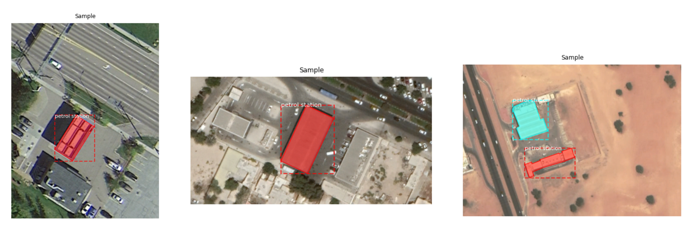
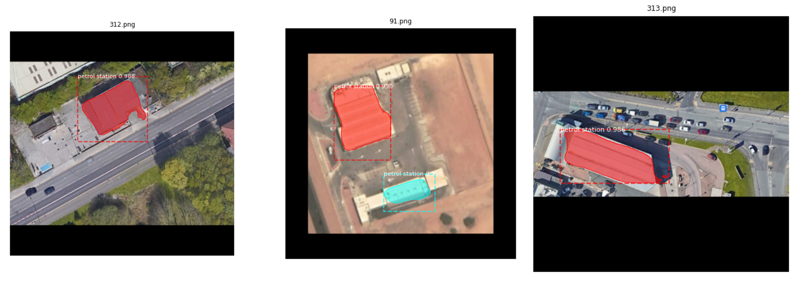

# MaskRCNN for Petrol Station Detection from Satellite Imagery

Aimed at enhancing spatial navigation, updating map databases, and supporting emergency response planning among other practical applications, this project implements a Mask RCNN model to detect and segment petrol stations from high-resolution satellite imagery. Initially developed during the Deep Learning Bootcamp at the Mohammed Bin Rashid Space Center (MBRSC), the project utilizes the Mask R-CNN model, a powerful tool for instance segmentation, to precisely identify and localize petrol stations in diverse environments.

Through transfer learning and extensive model optimization, the project has made significant strides in accurately localizing and segmenting petrol stations. Building atop the foundation laid during the boot camp, I have continued to explore model interpretability through feature map analysis and occlusion sensitivity testing. 

### Dataset 




- **Number of Images:** 400 
- **Source:** High resolution satellite imagery collected through **Google Earth Pro** focused on petrol stations 
- **Annotation Tool:** Images were annotated using the **VGG Image Annotator (VIA)** tool, which was shared during the bootcamp, to mark petrol station locations and boundaries


## Key Features 

- **Image Segmentation (Training & Testing):** Built upon the Mask R-CNN module shared during the MBRSC Deep Learning Bootcamp, this project includes the training and testing modules used to implement an advanced image segmentation model to detect and segment petrol stations from high-resolution satellite imagery. 

- **Feature Map Analysis:** To enhance model interpretability, feature map analysis is performed to visualize the activations of different layers. 

- **Occlusion Sensitivity:** By systematically occluding parts of the input image, we assess how the model's performance is impacted and identify which regions are critical for accurate detection and segmentation.


## Results 





## Installation 

1. Clone the repository and change directory

    ```bash
    git clone https://github.com/SaniaE/maskrcnn-petrol-pump-segmentation.git
    cd path/to/repo/clone
    ```
2. Create and activate a new virtual enviornment

    ```bash
    python -m venv <environment_name>
    .\<environment_name>\Scripts\activate   # For Windows
    source <environment_name>/bin/activate  # For macOS/Linux
    ```
3. Add virtual environment to the Python Kernel 

    ```bash
    python -m pip install --upgrade pip 
    pip install ipykernel 
    python -m ipykernel install --user --name=<kernel_name>
    ```
4. Install dependencies

    ```bash
    pip install -r requirements.txt
    ```
5. Launch Jupyter Notebook 

    ```bash
    jupyter notebook
    
6. About the notebooks:
    - `Train.ipynb` Created during the bootcamp, it walks through the process of training the Mask R-CNN model. It covers data loading, model setup, training loops, and performance evaluation.
    - `Test.ipynb` This notebook is used to test the trained model on new satellite images. It includes steps for model inference, visualizing predictions, and evaluating segmentation accuracy.
    - `Feature map analysis.ipynb` Visualizes and analyzes the feature maps generated by the model. 
    - `Occlusion Sensitivity Map.ipynb` Conveys the impact of occluding different parts of inference images 